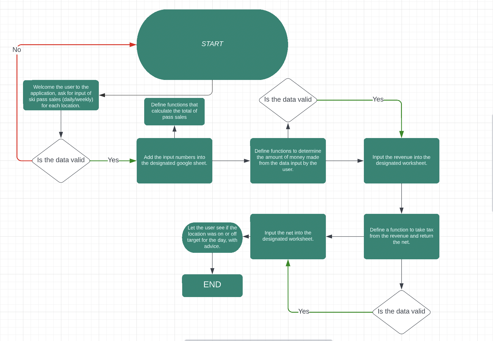

# Ski Pass Income Management System

This is a Ski Pass Income Management System with a minimal approach to make it simple to input daily sales numbers at the end of a shift.
These are some functions to look for.
* User input with validation
* Total passes sold calculator
* Update worksheet functions
* Calculate revenue from passes sold
* Calculate net from revenue
* Display expected sales numbers

### The Design CL: 
* The terminal was designed to clear itself after user validation inputs so that readability remains easy for the user.

To view the deployed project click [here](https://project-ski-pass.herokuapp.com/).

To view the relevant google worksheet click [here](https://docs.google.com/spreadsheets/d/1ekj8c7GE1SoqIlnr-7P-V2QF5FvT_RGlesSg2stoASs/edit?usp=sharing)

#  UXD

### Website Intentions
* The intentions of the program is simplicity and functionality, the website intends to offer a finance assistant for ski resorts who want to input and calculate sales at the end of the work day.
#### For The User
* A clear direction of where to click to get the desired result, with a natural flow of information as the user runs the program, clears unnecessary information after being displayed.

#### For The Developer
* This process was meant as a learning curve, trying to use elements of python which I was not familiar with at all, involving a tedious amount of analysing the code.

# FLOWCHART

# PROCESS

* The design process was inspired by Love Sandwiches walkthrough project, which taught a lot about the basics of python, which I tried to replicate in my own way in order to deconstruct how Python is written.
* I used print statements and os commands clear() in order to keep the code at a simple and readable workflow.
* Condensing any loops into comprehensions in order to save of space and learn more about how comprehensions work.

# PROGRAM FEATURES

## Intro Message
* The intro screen when the terminal loads is displayed and gives basic information about the program. 
* Gives a list of rules for the user on how to enter data into the command line without causing validity errors. 
* Asks the user to input a set of 5 numbers corresponding to sales, twice.

## Input Screen
* The program sequence after inputting the first set of data.
* Clean instructions for the user showing how to proceed with tge program.

## Confirmation and Clear
* Users decision at validation input impacts the code loops, if the uses proceeds by typing Y, they will update worksheets, do some calculations and occassionally return some comparison data.
* If the user enters invalid data, the code will be run again until the user inputs the correct data.

## Uploading to Worksheets
* After clicking to confirm upload, the data will upload to designated worksheet.

## Program End
* The Program ends when the user completes all data entry sequences or leaves the program.

# DESIGN CHANGES
There were design changes related to my own decisions since I was not understanding python so well.
* The project was changed from originally being an idea for a hangman game into a data entry program. Thanks to my mentors advice that python is designed more for data entry so I should play it to my strengths.

# FUTURE FEATURES
These are the features I would like to include in the program:
* Editing worksheet cells from program, incase of new locations, closures, deals etc.
* Add a quit button which the user can press in order to revoke all data from the current entry and reset the program.

# TESTING
In order to test python I had to install flake8, with this i performed a validation test which yielded positive results.

## BUGS:
* Had issues with the user validation not working properly if they user did not enter the specifcally listed key, this was easily fixed using breaks to repeat the loop.
* Fixed code being overcluttered with print statements by assigning all the necesarry print seperator statements into one variable.
* Had an issue with the creds.json leak, which I quickly followed instructions on how to fix, which was done swiftly and with ease.

# HEROKU DEPLOYMENT:
### TO DEPLOY THE PROGRAM
1. Make sure all dependencies are listed in your requirements.txt file. Type in your python terminal pip3 freeze > requirements.txt, to do this.
2. Commit this change.
3. Go to the Heroku website and navigate to the sign up button.
4. Next, click "New" in the top right-hand corner and select "Create new app".
5. Then choose an app name. It must be unique.
6. Then select "Europe" as your region.
7. Click "Create app" then navigate to the "Settings" tab.
8. Click on "Config Vars". For the first "KEY", input "CREDS". For "VALUE", input your entire creds.json file including the curly braces.
9. For the secon "KEY" write, "PORT". For the second "PORT", write "8000".
10. Scroll down to Buildpacks and select "Add buildpack".
11. Select Python first and then add another buildpack and select Node JS. Python must be listed above Node JS for this to work.
12. Scroll back to top and deploy with GitHub.
13. Now search for your GitHub repository name and select the correct repository.
14. Now scroll down to Automatic deploys and choose the "main" branch. Therefore, any changes that have been pushed through to GitHub will update the Heroku app.
15. Then scroll down to Manual deploy and click "Deploy Branch". When complete, click on "View", which will open a new tab and display your program.

# CREDITS: 
## CODE:
* Help from my extremely helpful mentor Rahul!
* The Love Sandwiches walkthrough project for teaching the fundamentals and getting started.

## TESTING:
[Flake8](https://flake8.pycqa.org/en/latest/) for Python validation.

[UI](https://ui.dev/amiresponsive?url=https://sizimon.github.io/P2/) for Responsiveness checking.

[Heroku](https://dashboard.heroku.com/apps) for program deployment.
